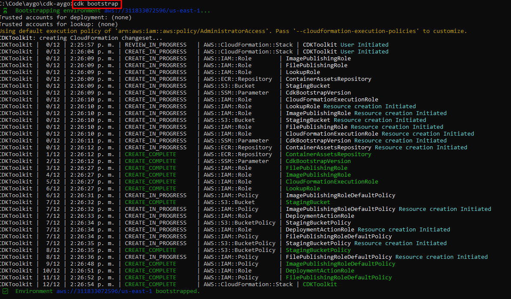
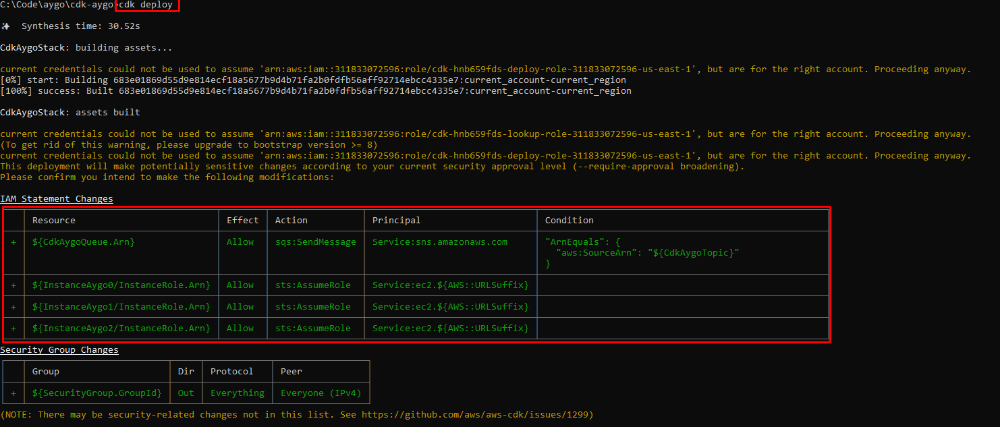
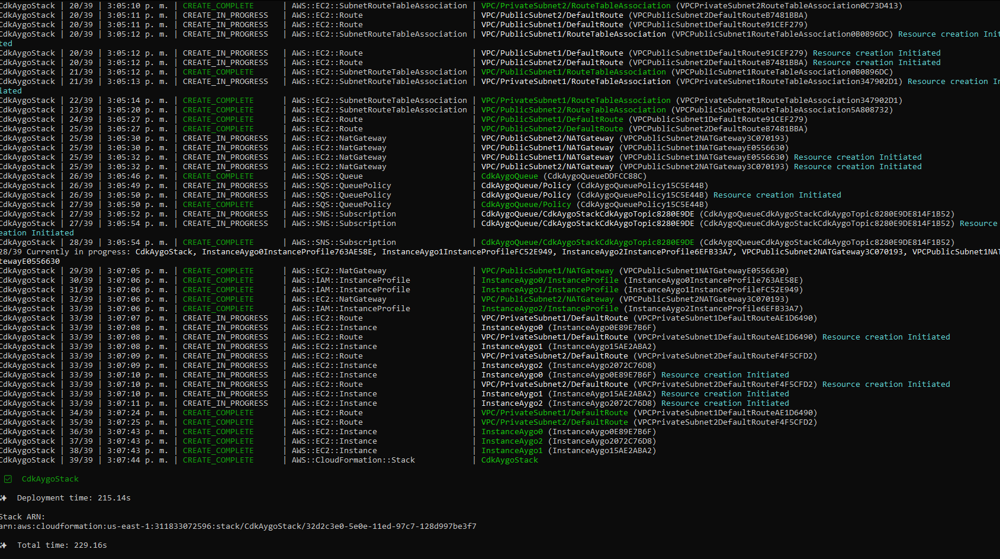
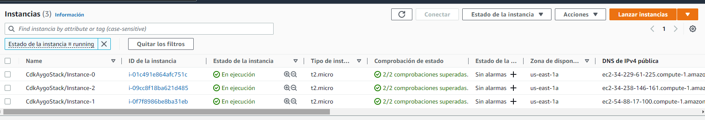
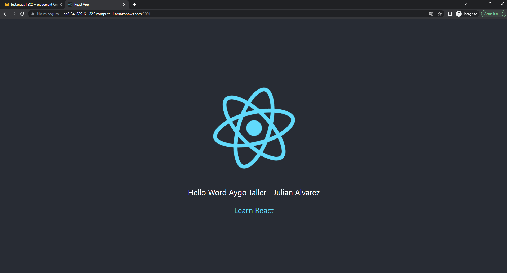
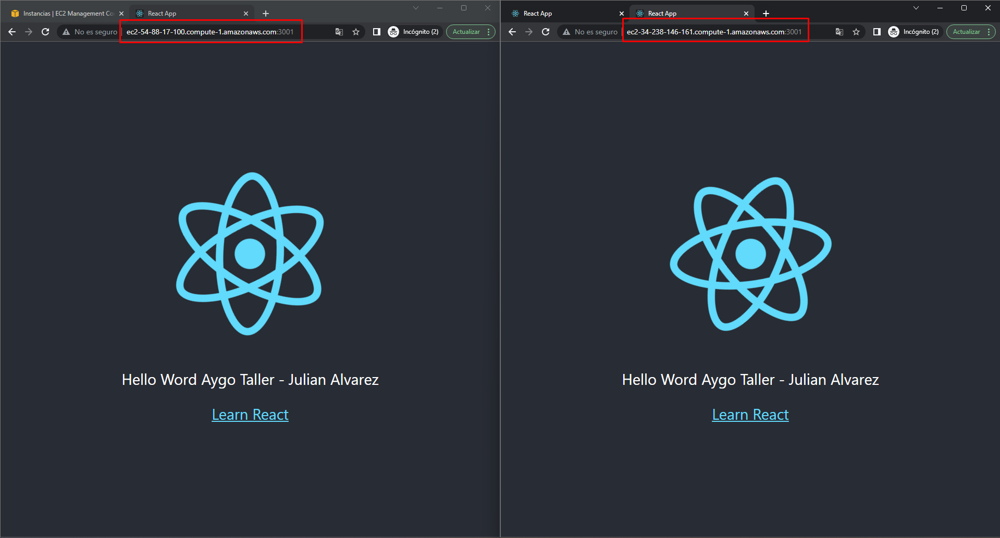
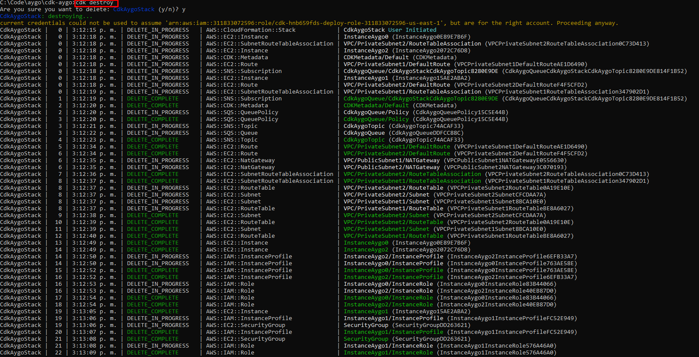

# Welcome to AYGO CDK Java project!

You should explore the contents of this project. It demonstrates a CDK app with an instance of a stack (`CdkAygoStack`)
which contains an Amazon SQS queue that is subscribed to an Amazon SNS topic.

The `cdk.json` file tells the CDK Toolkit how to execute your app.

It is a [Maven](https://maven.apache.org/) based project, so you can open this project with any Maven compatible Java IDE to build and run tests.
## Prerequisites

* [Java 8](https://www.oracle.com/technetwork/java/javase/downloads/jdk8-downloads-2133151.html)
* [Maven 3.6.0](https://maven.apache.org/download.cgi)
* [Node.js 16.15.1](https://nodejs.org/en/download/)
* [AWS CLI](https://docs.aws.amazon.com/cli/latest/userguide/cli-chap-install.html)
* [AWS CDK](https://docs.aws.amazon.com/cdk/latest/guide/getting_started.html)

## Useful commands

 * `mvn package`     compile and run tests
 * `cdk ls`          list all stacks in the app
 * `cdk synth`       emits the synthesized CloudFormation template
 * `cdk deploy`      deploy this stack to your default AWS account/region
 * `cdk diff`        compare deployed stack with current state
 * `cdk docs`        open CDK documentation

## Useful links

 * [AWS CDK](https://docs.aws.amazon.com/cdk/latest/guide/home.html)
 * [AWS CDK API Reference](https://docs.aws.amazon.com/cdk/api/latest/docs/aws-construct-library.html)

## Resources

  Git repository: https://github.com/julian36alvarez/React-Front-Aygo-Taller-3

## Result
  Result:

** **
**Emits the synthesized CloudFormation template**

** **
**Deploy this stack to your default AWS account/region**

** **
**Compare deployed stack with current state**

** **

**Check instances**

** **
**Instance 1**

** **

**Instance 2 - 3**

****
**Destroy instances**

## License

This library is licensed under the MIT-0 License. See the LICENSE file.

## Author

*Julian Alvarez*

